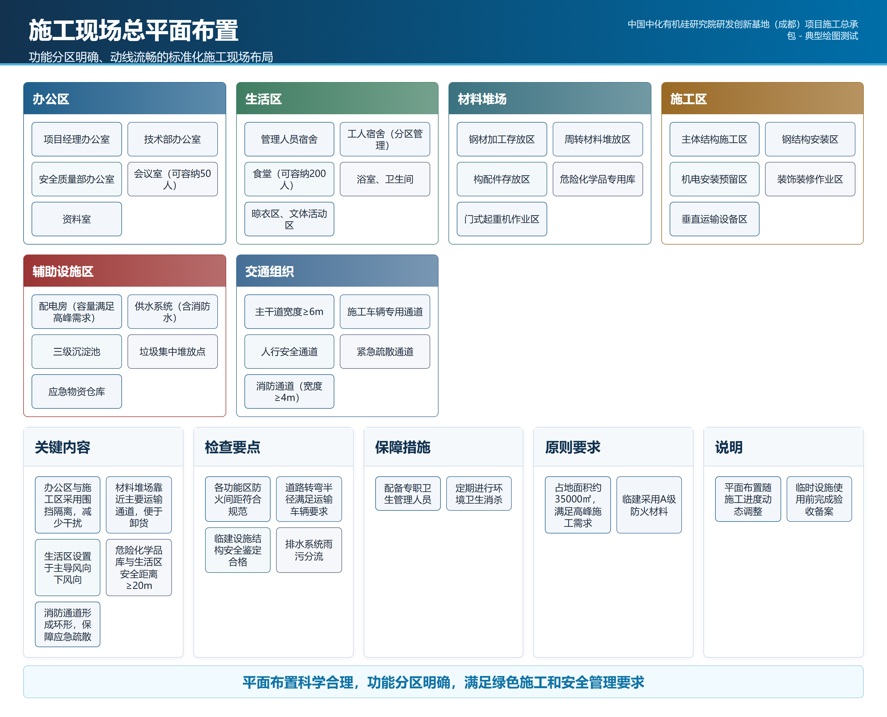

# 第二章 施工现场平面布置和临时设施

*表 2-1  施工现场临时设施配置表*

> 结构化说明办公区、生活区、材料堆场和施工区的配置要求。

| 设施类别 | 配置内容 | 管理要求 | 对应要求 |
| --- | --- | --- | --- |
| 办公区 | 项目经理部、会议室、资料室 | 统一标识、专人管理 | 现场管理要求 |
| 材料堆场 | 钢筋、模板、周转材料分区堆放 | 分类标识、防雨防潮 | 文明施工要求 |

> 注：表格内容应与施工总平面图保持一致。

*图 2-1  TU-002 图2 施工现场总平面布置图*

## 2.1 施工现场总平面布置

这里是测试正文，用于验证 S6 能把绘图工具 manifest 产物插入章节。

